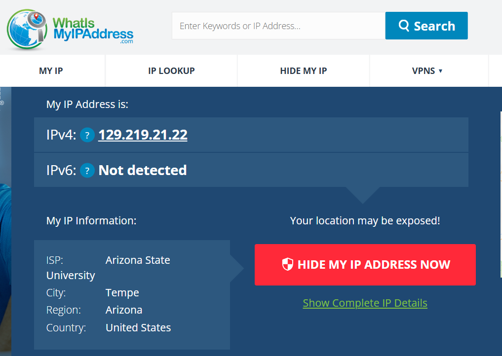
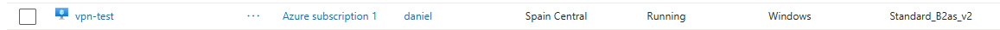
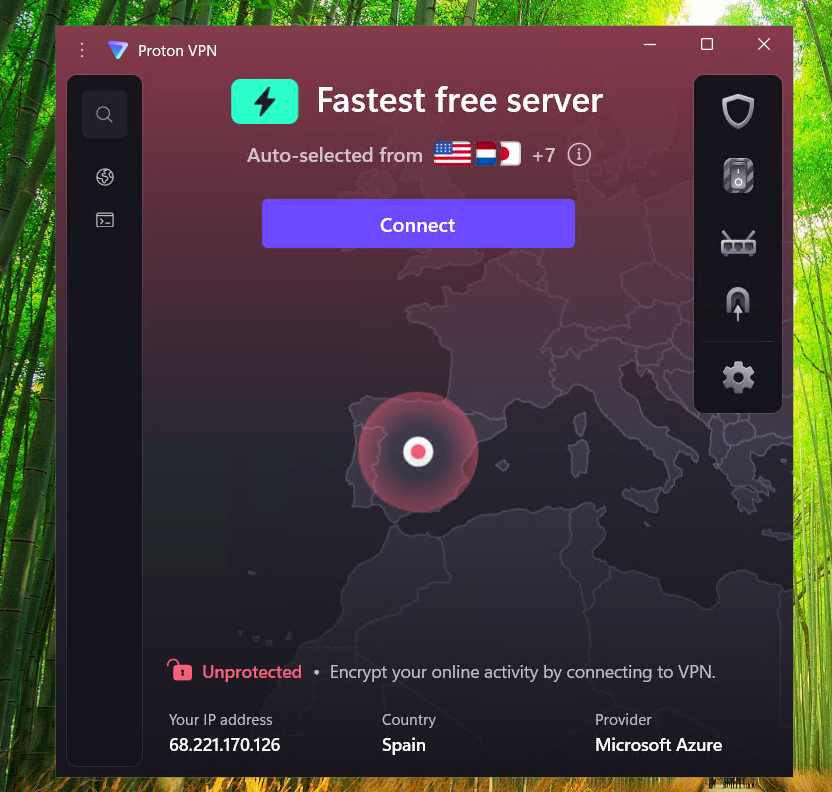
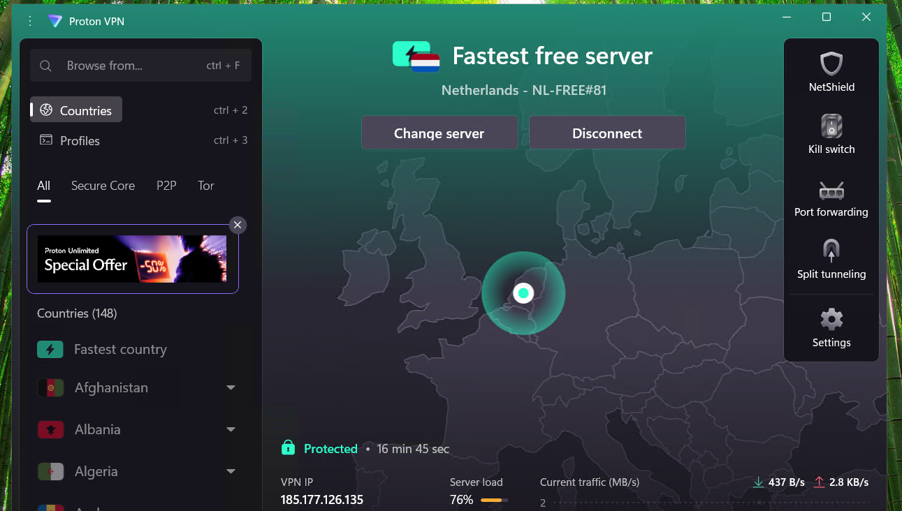
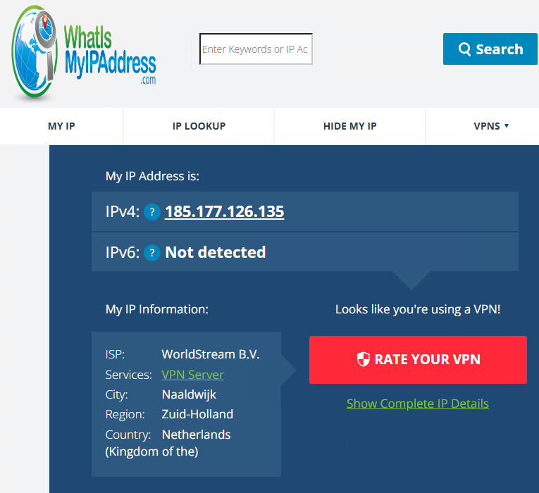

# 🔒 VPN & Network Privacy Lab

A networking lab using Microsoft Azure and Proton VPN to see how a VPN changes a device's public IP address and apparent location.

I created a Windows 11 virtual machine in Azure, connected to it with Remote Desktop, and compared its network information before and after connecting to a VPN.

---

## 🛠️ Technologies Used

- Microsoft Azure
- Windows 11 Pro
- Azure Virtual Machines
- Remote Desktop (RDP)
- Proton VPN
- Public IP Addressing
- IP Geolocation

---

## 🌐 1. Check My Local Public IP

I started by checking the public IP address and network information of my local computer.

The connection showed:

- **ISP:** Arizona State University
- **Location:** Tempe, Arizona, United States

This gave me a starting point to compare against the Azure VM and VPN connection later.



---

## ☁️ 2. Create the Azure Virtual Machine

Next, I created a Windows 11 virtual machine in Microsoft Azure.

I purposely selected a region outside of the United States so I could compare its network location with my local computer.

### VM Configuration

- **Name:** `vpn-test`
- **Region:** Spain Central
- **Operating System:** Windows 11 Pro
- **Size:** `Standard_B2as_v2`
- **vCPUs:** 2
- **RAM:** 8 GiB



---

## 🖥️ 3. Connect to the VM

After the VM was running, I used its public IP address to connect through Remote Desktop.

Before connecting to a VPN, I checked the VM's network information.

It showed:

- **Country:** Spain
- **Provider:** Microsoft Azure
- **VPN Status:** Unprotected



Even though I was controlling the VM from Arizona, internet traffic from inside the VM appeared to come from Spain.

At this point, the setup looked like:

```text
My Computer
Arizona
    │
    │ Remote Desktop
    ▼
Azure VM
Spain
    │
    ▼
 Internet
```

---

## 🔒 4. Connect to Proton VPN

Next, I installed Proton VPN on the Azure VM.

I connected to a free VPN server, which selected a server in the **Netherlands**.

Proton VPN now showed the connection as **Protected**.



---

## 🌍 5. Verify the New Public IP

With the VPN connected, I checked the VM's public IP information again.

The connection now showed:

- **ISP:** WorldStream B.V.
- **Service:** VPN Server
- **Location:** Naaldwijk, Netherlands



The VM was still hosted in Spain, but websites now saw the connection as coming from the VPN server in the Netherlands.

The final setup looked like:

```text
My Computer
Arizona
    │
    │ Remote Desktop
    ▼
Azure VM
Spain
    │
    │ VPN
    ▼
VPN Server
Netherlands
    │
    ▼
 Internet
```

---

## 📊 Results

| Connection | Provider | Location |
|---|---|---|
| Local Computer | Arizona State University | Arizona, United States |
| Azure VM | Microsoft Azure | Spain |
| Azure VM + VPN | WorldStream B.V. | Netherlands |

The public-facing network location changed at each stage:

**Arizona → Spain → Netherlands**

---

## 🧠 What I Learned

This lab helped me better understand:

- How public IP addresses identify an internet connection
- How public IP addresses can be associated with an ISP and approximate location
- How to create and remotely access a Windows VM in Microsoft Azure
- How Remote Desktop allows me to control a computer running in another location
- How a VPN changes the public IP address seen by websites
- How internet traffic can be routed through a VPN server in another country

---

## 📁 Repository Structure

```text
vpn-and-network-privacy-lab/
│
├── README.md
│
└── images/
    ├── local-ip.png
    ├── azure-vm.png
    ├── azure-vm-ip.png
    ├── proton-vpn.png
    └── vpn-ip.png
```
